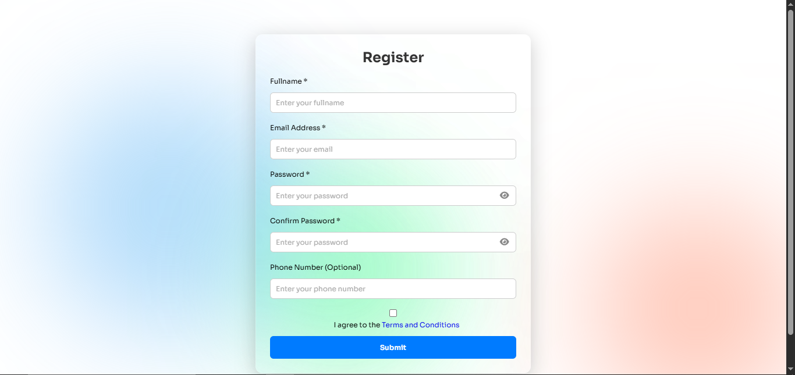

# 🔐 Form Validation with Real-Time Feedback, Password Checklist & Glasmorphism UI

A beautiful, user-friendly registration form built with **HTML, CSS, and JavaScript** featuring real-time validation, a live password strength checklist, animated background blobs, glasmorphism design, and localStorage integration to persist input data.

## 🚀 Live Demo

[Click to view demo](#) – *Add your GitHub Pages link here if hosted*

---

## 🎯 Features

- ✅ **Form Validation**
  - Real-time validation for name, email, password, phone, and terms.
  - Shows inline error messages when fields are invalid.
  - Success snackbar appears on valid form submission.

- 🧠 **Live Password Strength Checklist**
  - Dynamic checklist appears as users type in the password.
  - Highlights rules in green as they're satisfied:
    - Minimum 8 characters
    - Uppercase, lowercase letters
    - Numbers
    - Special characters

- 💾 **localStorage Support**
  - Saves non-sensitive form data as the user types.
  - Restores data when the page reloads.
  - Passwords are excluded for security.

- 🎨 **Beautiful UI Enhancements**
  - **Glasmorphism Effect** for the form container.
  - **Animated Blobs** in the background (pure CSS).
  - Fully responsive and modern design.

---

## 🧩 Technologies Used

- **HTML5**
- **CSS3**
  - Flexbox, animations, glasmorphism
- **JavaScript**
  - Event handling
  - Form validation
  - DOM manipulation
  - localStorage API

---


---

## 📸 Screenshots



---

```js
    document.getElementById('registerationForm').addEventListener('submit', function(event) {
    event.preventDefault(); // Prevent form submission

    // Clear previous error messages
    const errorMessages = document.querySelectorAll('.error-message');
    errorMessages.forEach(msg => msg.style.display = 'none');

    let fullName = document.getElementById('fullName').value.trim();
    let email = document.getElementById('email').value.trim();
    let password = document.getElementById('password').value.trim();
    let confirmPassword = document.getElementById('confirmPassword').value.trim();
    let phone = document.getElementById('phone').value.trim();
    let terms = document.getElementById('terms').checked;

    // Validate inputs
    let isValid = true;

    if (fullName === '') {
        showError('fullName', 'Full name must be at least 3 characters long');
        isValid = false;
    }

    if (email === '' || !validateEmail(email)) {
        showError('email', 'Please enter a valid email address');
        isValid = false;
    }

    if (password === '' || !validatePassword(password)) {
        showError('password', 'Password must be at least 8 characters long and contain at least one uppercase letter, one lowercase letter, one number, and one special character');
        isValid = false;
    }

    if (confirmPassword !== password) {
        showError('confirmPassword', 'Passwords do not match');
        isValid = false;
    }

    if (phone === '' || phone.length < 10) {
        showError('phone', 'Phone number must be at least 10 digits long');
        isValid = false;
    }

    if (!terms) {
        showError('terms', 'You must agree to the Terms and Conditions');
        isValid = false;
    }

    // If all validations pass, show success message
    if (isValid) {
        showSnackbar()
        localStorage.removeItem('fullName')
        localStorage.removeItem('email')
        localStorage.removeItem('phone')
        localStorage.removeItem('terms')
        event.target.reset()
    }
    
})

```
- This adds a submit event listener to the form. When the form is submitted I prevented the default beviour of the form by using event.
- All input fields are validated when the form is submitted, each input has a different validation.
- When the form is submitted it resets and removed from local storage.

```js
function showError(inputId, message) {
    const input = document.getElementById(inputId);
    const errorMessage = input.closest('.form-group').querySelector('.error-message');
    errorMessage.textContent = message;
    errorMessage.style.display = 'block';
    input.style.borderColor = 'red'
}
```
- This function is responsible for showing error when the required values are not met. It targets each input fields and displays a message.
- The border color also changes to red/green depending on the input.

```js
function showSuccess(inputId) {
    const input = document.getElementById(inputId);
    const errorMessage = input.closest('.form-group').querySelector('.error-message');
    errorMessage.textContent = '';
    errorMessage.style.display = 'none';
    input.style.borderColor = 'lightgreen'
}
```
- This is similar to the showError function. It the border color is green when the requiremets are met

```js
// Email validation function
function validateEmail(email) {
    const regex = /^[^\s@]+@[^\s@]+\.[^\s@]+$/;
    return regex.test(email);
}

// Password validation function
function validatePassword (password) {
    // Password must be at least 8 characters long, contain at least one uppercase letter, one lowercase letter, one number, and one special character
    const regex = /^(?=.*[a-z])(?=.*[A-Z])(?=.*\d).{8,}$/;
    return regex.test(password);
}

function showSnackbar () {
    const snackbar = document.getElementById('snackbar')
    snackbar.classList.add('show')
    snackbar.innerText = 'Form submitted successfully'

    setTimeout(() => {
        snackbar.classList.remove('show')
    }, 4000);
}
```
- These function validates the email and password
- The last function shows a message when the form is submitted.

```js
document.querySelectorAll('.fa-eye').forEach(icon => {
    icon.addEventListener('click', (event) => {
        const targetId = event.currentTarget.getAttribute('data-target')
        const passwordInput = document.getElementById(targetId)

        const isHidden = passwordInput.getAttribute('type') === 'password'
        passwordInput.setAttribute('type', isHidden ? 'text' : 'password')

        event.currentTarget.classList.toggle('fa-eye')
        event.currentTarget.classList.toggle('fa-eye-slash')
    })
})
```
- This adds a click event listener on the eye icon which toggles the visiblility of the password. It shows the password when I click on it.

```js
document.querySelectorAll('input').forEach(input => {
    input.addEventListener('input', () => {
        const error = input.closest('.form-group')?.querySelector('.error-message')
        if (error) error.style.display = 'none'
    })
})


document.getElementById('fullName').addEventListener('input', (event) => {
    const currentValue = event.target.value.trim()
    if (currentValue.length < 3) {
        showError('fullName', 'Full name must be at least 3 characters long')
    } else {
        showSuccess('fullName')
    }
})

document.getElementById('email').addEventListener('input', (event) => {
    const currentValue = event.target.value.trim()
    if (!currentValue.includes('@')) {
        showError('email', 'Email must include the @ symbol')
    } else if (!validateEmail(currentValue)) {
        showError('email', 'Please enter a valid email address.')
    } else {
        showSuccess('email')
    }
})

document.getElementById('password').addEventListener('input', (event) => {
    const currentValue = event.target.value.trim()
    if (currentValue.length < 3) {
        showError('password', 'Password must be at least 8 characters long, contain at least one uppercase letter, one lowercase letter, one number, and one special character')
    } else {
        showSuccess('password')
    }
})

document.getElementById('confirmPassword').addEventListener('input', (event) => {
    const currentValue = event.target.value.trim()
    if (currentValue.length < 3) {
        showError('confirmPassword', 'Password do not match')
    } else {
        showSuccess('confirmPassword')
    }
})

document.getElementById('phone').addEventListener('input', (event) => {
    const currentValue = event.target.value.trim()
    const regex = /^\d{10,}$/ 
    if (currentValue !== '' && !regex.test(currentValue)) {
        showError('phone', 'Full name must be at least 3 characters long')
    } else {
        showSuccess('phone')
    }
})
```
- This adds an input event listener to all input, it listens for when one types in the input field and validates based on the requirements.

```js
function createPasswordChecklist () {
    const checkList = document.createElement('ul')
    checkList.id = 'passwordChecklist'
    checkList.classList.add('password-checklist')
    checkList.innerHTML = `
        <li id="check-length"><i class="fa-solid fa-check"></i>At least 8 characters</li>
        <li id="check-uppercase"><i class="fa-solid fa-check"></i>At least one uppercse letter</li>
        <li id="check-lowercase"><i class="fa-solid fa-check"></i>At least one lowercase letter</li>
        <li id="check-number"><i class="fa-solid fa-check"></i>At least one number</li>
        <li id="check-symbol"><i class="fa-solid fa-check"></i>At least one special character</li>
        `
        return checkList
}
```
- This function generates a list for the password input, it checks if any requiremets are met and displays them.

```js
document.getElementById('password').addEventListener('input', (event) => {
    const value = event.target.value
    const parent = event.target.closest('.form-group')

    // Creates the list based on users input when users starts typing.
    if (!checklistInserted && value.length > 0) {
        const checkList = createPasswordChecklist()
        parent.appendChild(checkList)
        checklistInserted = true
    }

    // Remove checklist if input is cleared
    if (value.length === 0) {
        const existing = document.getElementById('passwordChecklist')
        if (existing) {
            existing.remove()
            checklistInserted = false
        }
        return
    }

    toggleRule('check-length', value.length >= 8)
    toggleRule('check-uppercase', /[A-Z]/.test(value))
    toggleRule('check-lowercase', /[a-z]/.test(value))
    toggleRule('check-number', /\d/.test(value))
    toggleRule('check-symbol', /[@$!%*?&]/.test(value))
})

function toggleRule (id, condition) {
    const element = document.getElementById(id)
    if (!element) return
    element.classList.toggle('valid', condition)
}
```
- As one type, the password input validates and check if any requirements are met. It checks for length, uppercase, lowercase etc.
- The toggleRule function displays the list if the requirements are met.

```js
document.querySelectorAll('#registerationForm input').forEach(input => {
    if (input.type !== 'password' && input.type !== 'checkbox') {
        input.addEventListener('input', () => {
            localStorage.setItem(input.id, input.value)
        })
    }

    if (input.type === 'checkbox') {
        input.addEventListener('change', () => {
            localStorage.setItem(input.id, input.checked)
        })
    }
})

window.addEventListener('DOMContentLoaded', () => {
    document.querySelectorAll('#registerationForm input').forEach(input => {
        const savedValue = localStorage.getItem(input.id)

        if (savedValue !== null) {
            if (input.type === 'checkbox') {
                input.checked = savedValue === 'true'
            } else if (input.type !== 'password') {
                input.value = savedValue
            }
        }
    })
})
```
- This set user details to local storage and also fetches them from local storage when the page is refreshed (if any).


## 🛠️ How to Use

1. Clone this repo:
   ```bash
   git clone https://github.com/yourusername/form-validation-project.git
